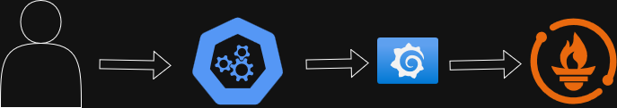

# 📊 DevOps Monitoring Stack

Projeto de observabilidade...

Descrição: 
Este projeto demonstra a implementação de um ambiente de observabilidade containerizado, onde uma aplicação Node.js expõe métricas customizadas consumidas pelo Prometheus e visualizadas em dashboards no Grafana. 
A solução foi estruturada utilizando Docker e Docker Compose, simulando um cenário real de monitoramento de aplicações e aplicando conceitos fundamentais de Observabilidade e SRE.

## 🏗️ Arquitetura

## 🧠 Skills Demonstradas

Este projeto demonstra conhecimentos práticos em:

- 🐳 Containerização de aplicações utilizando Docker
- 📦 Orquestração de múltiplos serviços com Docker Compose
- 📊 Exposição de métricas customizadas com Prometheus Client
- 🔄 Monitoramento baseado no modelo Pull (Prometheus scraping)
- 📈 Criação de dashboards e visualização de métricas no Grafana
- 🛠️ Configuração de comunicação entre containers via rede interna
- 🚦 Conceitos iniciais de SRE e observabilidade

## 🎯 Objetivo Técnico

Simular um ambiente real de observabilidade onde uma aplicação expõe métricas customizadas que são coletadas via scraping pelo Prometheus e posteriormente analisadas em dashboards no Grafana.

